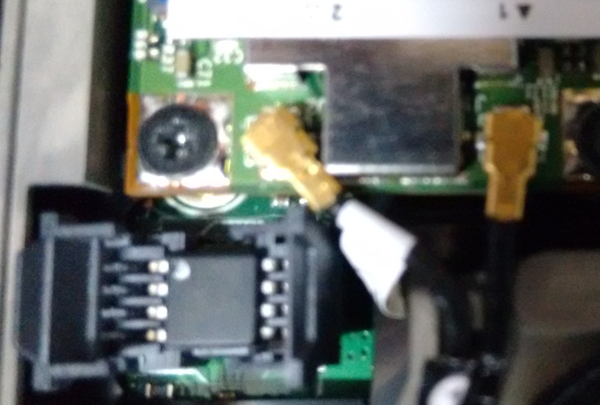

## 从2760p取出BIOS芯片
感谢MUDBOY@hpfocus指出2760p的BIOS芯片的位置，我可以继续接下来的工作了。

2760p的BIOS芯片其实就在无线网卡旁边，只是被一个插座封装起来了，所以一开始的时候我拆下主板都找不到。知道了芯片的位置之后，其实只要拆掉底盖，拿个东西把无线网卡旁边的插座的盖子往上掰开就行了。

用镊子可以直接把芯片取出，芯片的型号是MX25L6445E.

