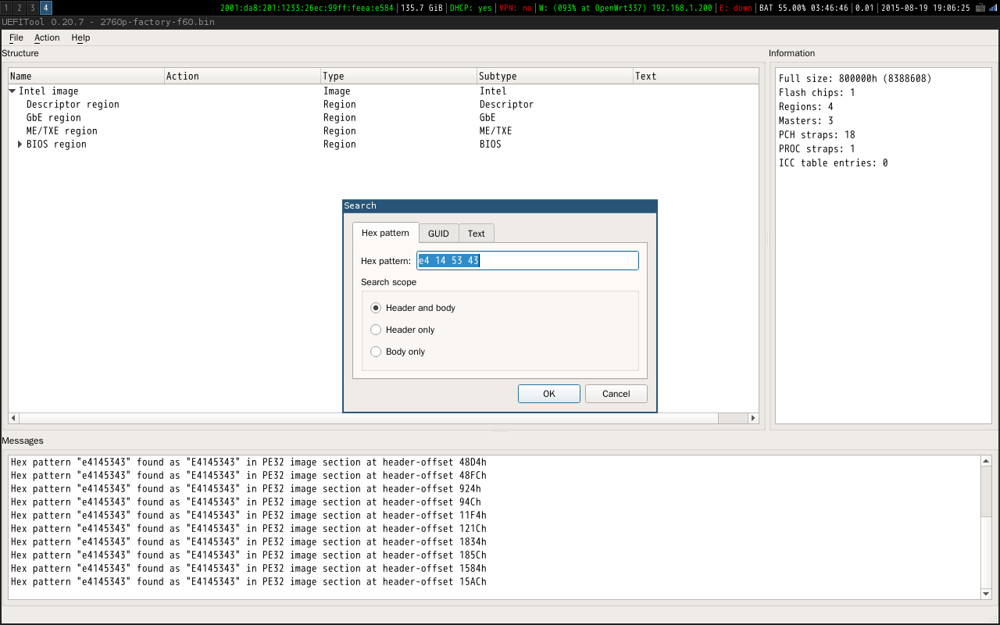

## 用UEFITool分析BIOS
UEFITool是分析UEFI固件的利器，而且它是开源工具，可以在不同的操作系统中使用。比较新的固件都采用UEFI框架，于是各个厂商做的固件都有相同的结构，都可以使用UEFITool进行分析和修改。

以下以我备份出的2760p的原厂BIOS为例讲解UEFITool的使用。

首先打开文件，可以看到UEFITool直接可以分析文件的结构。

可以搜索整个UEFI镜像中包含的字符串，UEFITool可以直接进入压缩后的镜像进行搜索，也支持Unicode字符的搜索。图中是我尝试搜索我的网卡的设备ID(14e4:4353)的过程。

搜到想要的东西之后，可以把内容提取出来，如图可以直接提取出一个EFI程序，注意到在右侧Information一栏还显示了这个EFI程序的信息，如程序入口点。

在提取了所要的内容之后，可以进行修改，最后用Replace body替换就行了。

