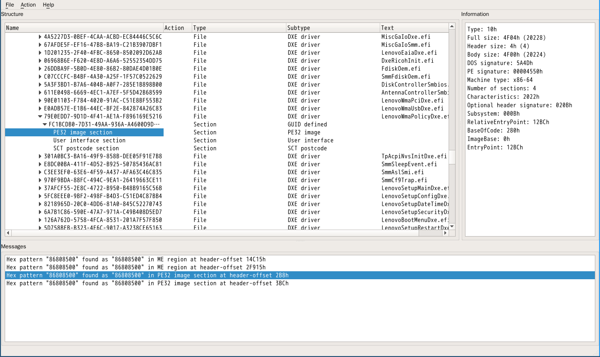

## ThinkPad UEFI固件白名单去除
从Sandy Bridge一代开始，ThinkPad开始使用UEFI结构的固件，因此可以很容易地用UEFITool分析。以下可以用简单的方法去除ThinkPad UEFI固件的白名单。

首先还是打开UEFITool,搜索网卡的id,可以定位到LenovoWmaPolicyDxe.efi这个DXE驱动。我们在PE32 image section右键，选extract body把这个EFI程序提取到/tmp/wl.efi.



由于UEFI的驱动是以函数的形式被调用的，驱动执行结束后以ret指令返回，使控制权回到调用者。因此我们可以直接把这个模块的入口点处指令直接修改为ret(0xc3).在UEFITool中可以看到EntryPoint的地址，直接用wxmedit等编辑器修改就行了。我用的是radare2:
```
r2 -w -c 'wa ret' /tmp/wl.efi
```

修改结束后覆盖掉原有的模块，还是在刚才的PE32 image section处，右键选replace body，选择刚才改好的EFI文件，看到UEFITool显示Replace,Rebuild等词时说明已经操作完成了。然后直接保存，UEFITool会提示另存为一个新文件。

然后刷那个新文件，白名单已经没了。

更新: 在知道了UEFITool中有一个UEFIPatch工具之后，发现用UEFIPatch更加方便。首先可以找出入口点开头的指令是sub rsp,0x38和call xxxx.于是把这几个字节的模式拿出来，之后让UEFIPatch找到这个模式，然后替换就行了，我们写如下patches.txt文件。(井号开头的是注释，可以去掉。)之后执行``UEFIPatch <ROMFILE>''，得到一个以.patched的新文件即为修改好的文件。


```
# patches.txt
# Patch string format
# FileGuid SectionType PatchType:FindPatternOrOffset:ReplacePattern 
# Please ensure that the latest symbol in patch string is space

# Possible section types:
#  PE32 image                    10
#  Position-independent code     11
#  TE Image                      12
#  DXE Dependency                13
#  Version information           14
#  User interface string         15
#  16-bit code                   16
#  Guided freeform               18
#  Raw data                      19
#  PEI Dependency                1B
#  SMM Dependency                1C
# Please do not try another section types, it can make the resulting image broken

# Possible patch types:
#  P - pattern-based, first parameter is a pattern to find, second - a pattern to replace
#  O - offset-based, first parameter is hexadecimal offset, second - a pattern to replace
# Patterns can have . as "any possible value" symbol

# LenovoWmaPolicyDxe.efi:
# replace the first two instructions to a ret and several nops
# do not remove the last SPACE of the next line
79E0EDD7-9D1D-4F41-AE1A-F896169E5216 10 P:4883EC..E8:C390909090 

```

注:
- 此方案只对ThinkPad的UEFI固件有效，而且未做足够的测试，如果有问题请给issue说明。
- 在学习UEFI之后，我准备再次对这个模块进行逆向分析。
- 传统修改方案及刷写方法请参考: [xx30 BIOS Whitelist Removal](https://github.com/bibanon/Coreboot-ThinkPads/wiki/xx30-BIOS-Whitelist-Removal)

已测试机型:
- X220 (写本文时所用的机型)
- W530 (见[51nb](http://forum.51nb.com/forum.php?mod=viewthread&tid=1623560&extra=page%3D1%26filter%3Ddigest%26digest%3D1)文章)
- T520 (本人测试)
- T430i ([测试失败，能启动但网卡启动失败](http://forum.51nb.com/forum.php?mod=viewthread&tid=1661941&extra=page%3D2%26filter%3Dtypeid%26typeid%3D4))
- X230([有人修改，结果未知](http://forum.51nb.com/forum.php?mod=viewthread&tid=1664487&extra=page%3D1%26filter%3Dtypeid%26typeid%3D4))
