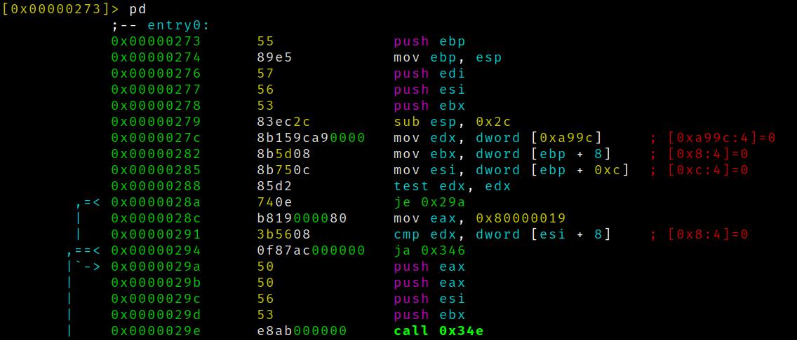
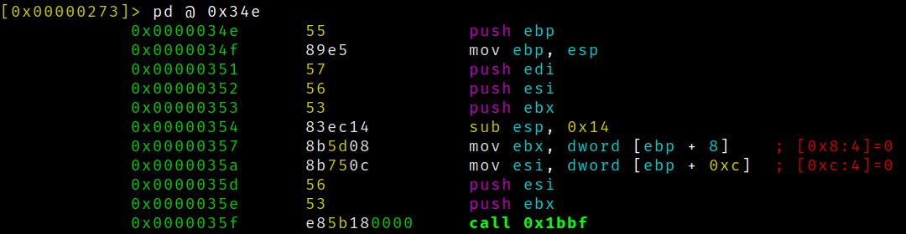
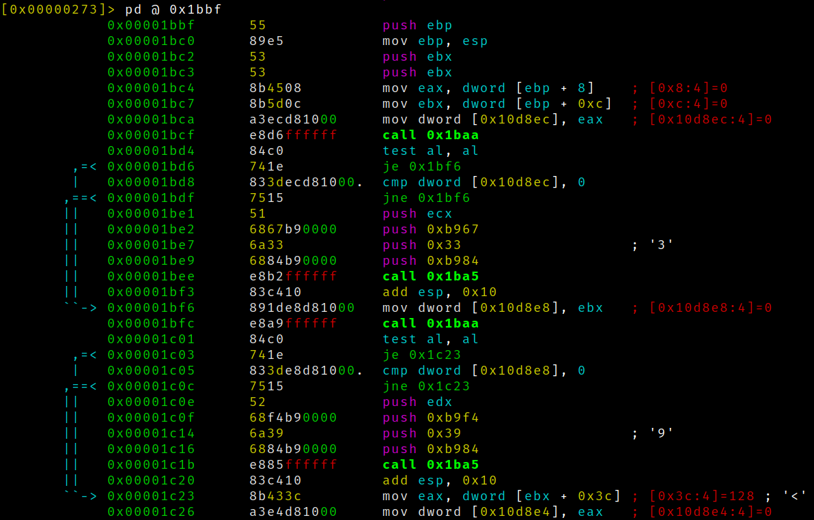
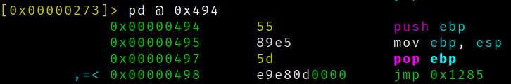

## UEFI逆向方法分析

为了逆向UEFI固件，我打算先研究UEFI模块编译出来之后是怎么样的。由于我的毕业设计是用EDK II做的，因此就先拿一个编译出来的EDK II模块进行分析。

我分析的模块是一个DXE驱动，架构是IA32.

首先从入口点开始分析，对于驱动模块，在构建时要包含UefiDriverEntryPoint这个LibraryClass.其实UefiDriverEntryPoint是真正入口点所在的地方，具体源文件为``MdePkg/Library/UefiDriverEntryPoint/DriverEntryPoint.c``.

```
EFI_STATUS
EFIAPI
_ModuleEntryPoint (
  IN EFI_HANDLE        ImageHandle,
  IN EFI_SYSTEM_TABLE  *SystemTable
  )
{
  EFI_STATUS                 Status;
  EFI_LOADED_IMAGE_PROTOCOL  *LoadedImage;

  if (_gUefiDriverRevision != 0) {
    //
    // Make sure that the EFI/UEFI spec revision of the platform is >= EFI/UEFI spec revision of the driver
    //
    if (SystemTable->Hdr.Revision < _gUefiDriverRevision) {
      return EFI_INCOMPATIBLE_VERSION;
    }
  }

  //
  // Call constructor for all libraries
  //
  ProcessLibraryConstructorList (ImageHandle, SystemTable);

  //
  //  Install unload handler...
  //
  if (_gDriverUnloadImageCount != 0) {
    Status = gBS->HandleProtocol (
                    ImageHandle,
                    &gEfiLoadedImageProtocolGuid,
                    (VOID **)&LoadedImage
                    );
    ASSERT_EFI_ERROR (Status);
    LoadedImage->Unload = _DriverUnloadHandler;
  }

  //
  // Call the driver entry point
  //
  Status = ProcessModuleEntryPointList (ImageHandle, SystemTable);

  //
  // If all of the drivers returned errors, then invoke all of the library destructors
  //
  if (EFI_ERROR (Status)) {
    ProcessLibraryDestructorList (ImageHandle, SystemTable);
  }

  //
  // Return the cummalative return status code from all of the driver entry points
  //
  return Status;
}
```

以上``_ModuleEntryPoint``就是入口点，参数为``ImageHandle``和``SystemTable``，在IA32下，这两个参数都是用栈传入的。我们对照一下汇编：



可以发现``ImageHandle``和``SystemTable``分别在ebx和esi两个寄存器里面，并且还能看到全局变量``_gUefiDriverRevision``的地址0xa99c，还有常数0x80000019其实是``EFI_INCOMPATIBLE_VERSION``.

接着是``ProcessLibraryConstructorList``过程，对应的就是``call 0x34e``这条指令了。首先，我们要找到这个过程所在位置，它实际上在EDK II构建系统自动生成的``Autogen.c``里面，我们还是看看源码：

```
VOID
EFIAPI
ProcessLibraryConstructorList (
  IN EFI_HANDLE        ImageHandle,
  IN EFI_SYSTEM_TABLE  *SystemTable
  )
{
  EFI_STATUS  Status;

  Status = UefiBootServicesTableLibConstructor (ImageHandle, SystemTable);
  ASSERT_EFI_ERROR (Status);

  Status = UefiRuntimeServicesTableLibConstructor (ImageHandle, SystemTable);
  ASSERT_EFI_ERROR (Status);

  Status = UefiLibConstructor (ImageHandle, SystemTable);
  ASSERT_EFI_ERROR (Status);

}
```

反汇编0x34e处的代码如下：



这个call一看就很清楚。顺便说一下，由于这个模块使用Debug的方式构建的，因此生成了一些无用代码，``ASSERT_EFI_ERROR``这些宏也产生了不少混乱的代码，因此分析时有点麻烦，我们这里只看``UefiBootServicesTableLibConstructor``，我们可以在``MdePkg/Library/UefiBootServicesTableLib/UefiBootServicesTableLib.c``中看到源码：

```
EFI_STATUS
EFIAPI
UefiBootServicesTableLibConstructor (
  IN EFI_HANDLE        ImageHandle,
  IN EFI_SYSTEM_TABLE  *SystemTable
  )
{
  //
  // Cache the Image Handle
  //
  gImageHandle = ImageHandle;
  ASSERT (gImageHandle != NULL);

  //
  // Cache pointer to the EFI System Table
  //
  gST = SystemTable;
  ASSERT (gST != NULL);

  //
  // Cache pointer to the EFI Boot Services Table
  //
  gBS = SystemTable->BootServices;
  ASSERT (gBS != NULL);

  return EFI_SUCCESS;
}
```



对比一下汇编，其中几个call都是ASSERT生成的。汇编中的几个mov dword指令就是给``gImageHandle``,``gST``,``gBS``赋值的指令，非常容易对应起来。

最后我们分析``ProcessModuleEntryPointList``,这个过程在``Autogen.c``里面：

```
EFI_STATUS
EFIAPI
ProcessModuleEntryPointList (
  IN EFI_HANDLE        ImageHandle,
  IN EFI_SYSTEM_TABLE  *SystemTable
  )

{
  return UefiMain (ImageHandle, SystemTable);
}
```



可能有的人对于这个反汇编的结果有点奇怪，因为没有看到调用模块入口的call指令，而是一个jmp指令。这是因为这个调用是``ProcessModuleEntryPointList``最后的语句，因此可以使用尾调用优化，直接使用当前的调用栈，减少一次call的开销。

于是从模块入口经过了这么多的指令之后，才走到了程序员编写的UEFI模块的入口函数，接下来才是逆向UEFI固件的关键。当然了，各个厂商的UEFI代码是不一样的，但是基本上每个模块都会初始化gST,gBS,gRT这些全局变量，可以根据这些来判断哪些才是这个UEFI模块的关键逻辑。
